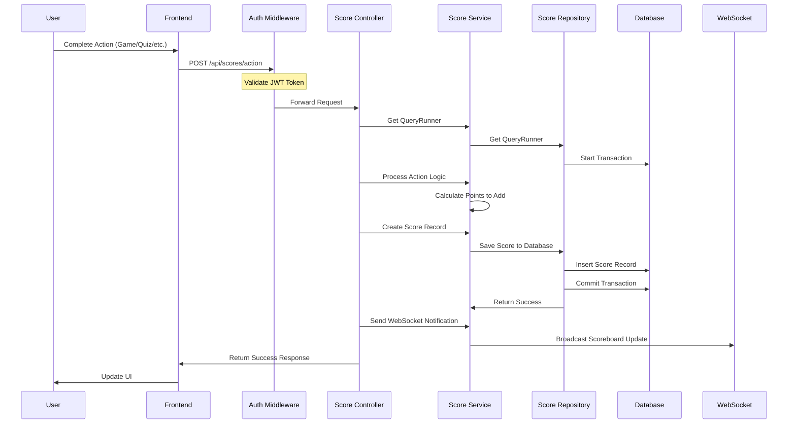
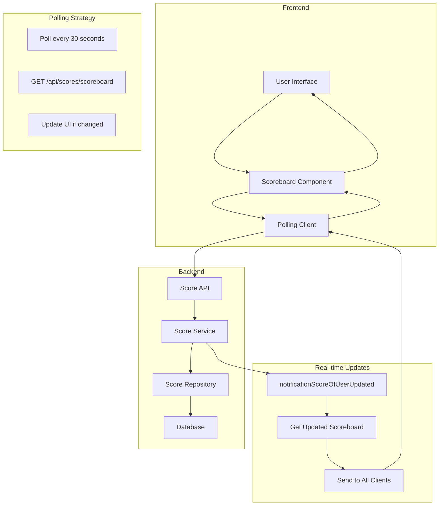

# Score Module - Flow Diagram

## 1. Action Handling Flow (Main Flow)

```mermaid
sequenceDiagram
    participant U as User
    participant F as Frontend
    participant A as Auth Middleware
    participant C as Score Controller
    participant S as Score Service
    participant R as Score Repository
    participant DB as Database
    participant WS as WebSocket

    U->>F: Complete Action (Game/Quiz/etc.)
    F->>A: POST /api/scores/action
    Note over A: Validate JWT Token
    A->>C: Forward Request
    C->>S: Get QueryRunner
    S->>R: Get QueryRunner
    R->>DB: Start Transaction
    C->>S: Process Action Logic
    S->>S: Calculate Points to Add
    C->>S: Create Score Record
    S->>R: Save Score to Database
    R->>DB: Insert Score Record
    R->>DB: Commit Transaction
    R->>S: Return Success
    C->>S: Send WebSocket Notification
    S->>WS: Broadcast Scoreboard Update
    C->>F: Return Success Response
    F->>U: Update UI
```

## 2. Live Update Architecture

```mermaid
graph TB

    subgraph "Frontend"
        A[User Interface]
        B[Scoreboard Component]
        C[Polling Client]
    end

    subgraph "Backend"
        D[Score API]
        E[Score Service]
        F[Score Repository]
        G[Database]
    end

    subgraph "Real-time Updates"
        H[notificationScoreOfUserUpdated]
        I[Get Updated Scoreboard]
        J[Send to All Clients]
    end

    A --> B
    B --> C
    C --> D
    D --> E
    E --> F
    F --> G
    E --> H
    H --> I
    I --> J
    J --> C
    C --> B
    B --> A

    subgraph "Polling Strategy"
        K[Poll every 30 seconds]
        L[GET /api/scores/scoreboard]
        M[Update UI if changed]
    end
```
